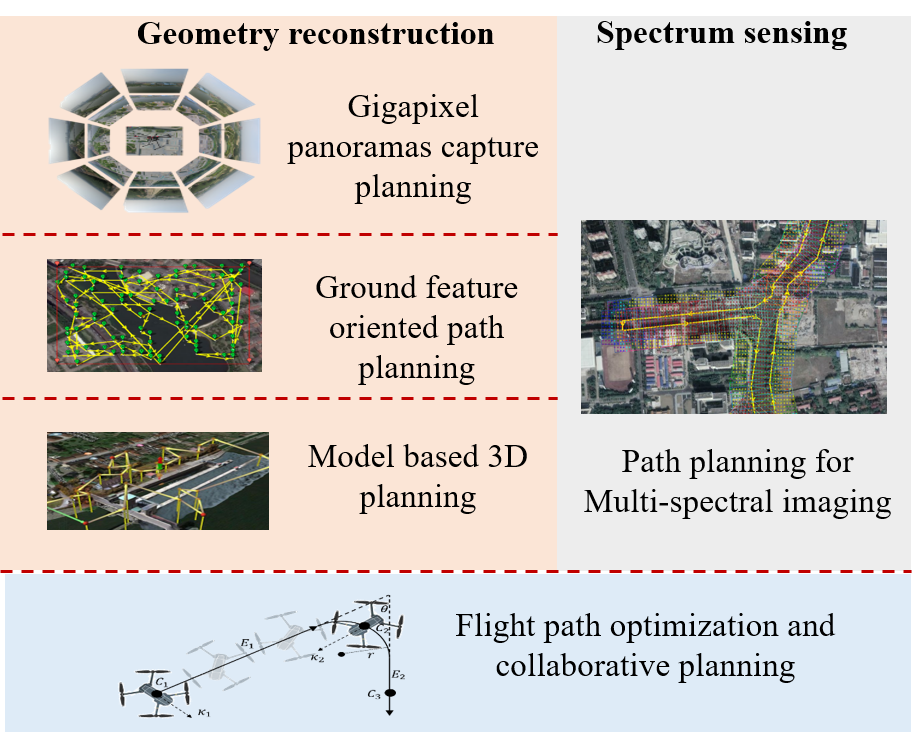

{:height="90%" width="90%"}

I am an assistant professor at School of Geospatial Engineering and Science, Sun Yat-sen University. My research interests are photogrammetry, spatial analysis and view planning, aiming at planning paths for UAVs to achieve more complete and precise 3D reconstruction. I got my Doctor of Engineering degree from [College of Surveying and Geo-informatics, Tongji University](https://celiang.tongji.edu.cn/index.php?classid=12708) in 2020, under the supervision of [Prof. Chun Liu](https://celiang.tongji.edu.cn/index.php?classid=5786&t=show&id=7). During 2018-2019, I worked as a joint PhD student at [Institute for Photogrammetry, University of Stuttgart](https://www.ifp.uni-stuttgart.de/en/) under the supervision of [Prof. Dr.-Ing. Norbert Haala](https://www.ifp.uni-stuttgart.de/en/institute/team/Haala-00001/). 

Research
======
My current research is about the mission planning of UAVs for airborne data acquisition, including geometry reconstruction and spectral sensing. I am doing the optimization of flight path, and collaborative planning as well, to increase the effieciency of UAV data acquisition. 

{:height="70%" width="70%"}

1. [**Gigapixel panoramas capture planning.**]() Panoramic image acquisition planning for arbitary focal length using single gimbaled camera.
1. [**Ground feature oriented path planning.**]() A ground feature oriented path-planning methodUAVs mapping feature-poor area like water or snow.
1. [**Model based 3D planning.**]() Path planning for UAV complete and precise 3D reconstruction based on the analysis of *a priori* model.
1. **Path planning for Multi-spectral imaging.** Path planning for multi-spectral imaging of river network.
1. **Flight path optimization and collaborative planning** UAV flight path optimization method based on energy cost, and parallel task allocation and scheduling for multiple UAVs.