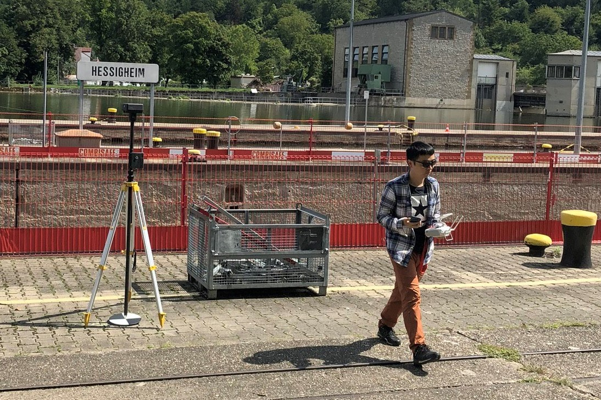

I am an assistant professor at School of Geospatial Engineering and Science, Sun Yat-sen University. My research interests are photogrammetry, spatial analysis and view planning, aiming at planning paths for UAVs to achieve more complete and precise 3D reconstruction. I got my Doctor of Engineering degree from [College of Surveying and Geo-informatics, Tongji University](https://celiang.tongji.edu.cn/index.php?classid=12708) in 2020, under the supervision of [Prof. Chun Liu](https://celiang.tongji.edu.cn/index.php?classid=5786&t=show&id=7). During 2018-2019, I worked as a joint PhD student at [Institute for Photogrammetry, University of Stuttgart](https://www.ifp.uni-stuttgart.de/en/) under the supervision of [Prof. Dr.-Ing. Norbert Haala](https://www.ifp.uni-stuttgart.de/en/institute/team/Haala-00001/). 

Research
======
