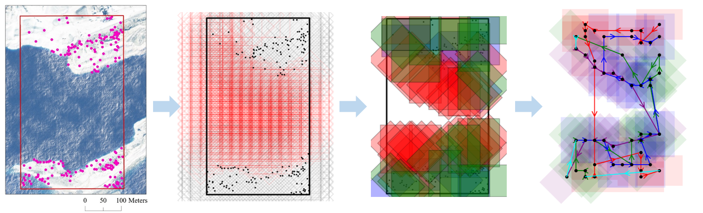
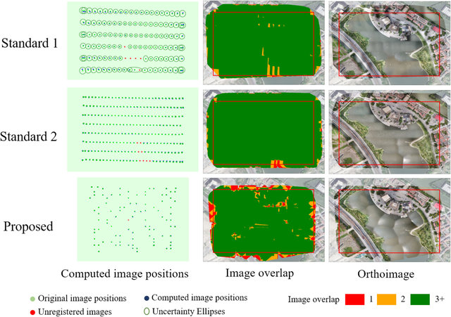

This paper proposes a ground feature oriented path-planning method for UAV mapping. The method first estimates the distribution of the ground feature points from a lower-resolution image. Then, image footprints are selected by applying a three-step optimization. The flight path for the UAV is then generated by solving the “grouped traveling salesman” problem. This approach ensures the georegistration of images during orthoimage stitching while maximizing the orthoimage coverage. 

The figure below demonstrates the workflow of the method. See the paper for detail.

The figure below shows the comparison of orthoimages between the proposed method and nadir path. 

[Download paper here](https://www.researchgate.net/profile/Shuhang_Zhang3/publication/331617822_Ground_Feature_Oriented_Path_Planning_for_Unmanned_Aerial_Vehicle_Mapping/links/5cdd5ae2299bf14d959d8fd9/Ground-Feature-Oriented-Path-Planning-for-Unmanned-Aerial-Vehicle-Mapping.pdf)

Recommended citation: Liu, C., Zhang, S., & Akbar, A. (2019). Ground Feature Oriented Path Planning for Unmanned Aerial Vehicle Mapping. IEEE Journal of Selected Topics in Applied Earth Observations and Remote Sensing, 12(4), 1175-1187.