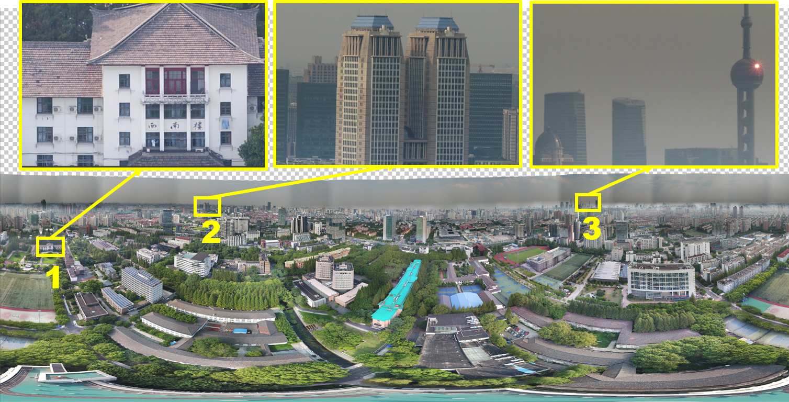

A panoramic image acquisition planning method is proposed in this paper. The method defines image overlaps via a ray casting procedure and then generates an acquisition plan according to the constraints of horizontal and vertical overlap thresholds. This method ensures the completeness of the panorama by maintaining the overlap between adjacent images. 

The figure below shows a 3.8 billion pixel panorama acquired by the proposed method with DJI Inspire 2 & 45 mm lens. 

[Download paper here](http://downloads.hindawi.com/journals/js/2019/4845104.pdf)

Recommended citation: Zhang, S., Liu, C., & Zhou, Y. (2019). UAV-Based Gigapixel Panoramic Image Acquisition Planning with Ray Casting-Based Overlap Constraints. Journal of Sensors, 2019.