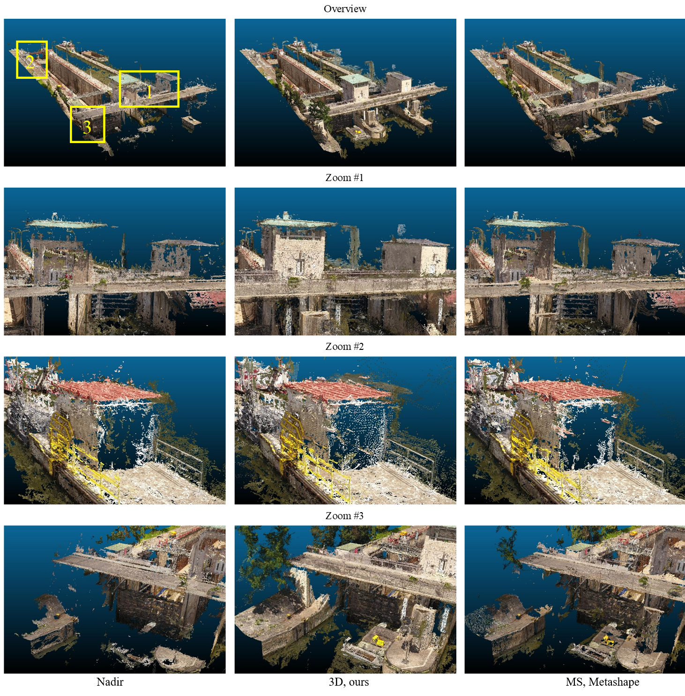

We propose a 3D path planning method for multirotor UAVs aiming at capturing images for complete and precise photogrammetric 3D reconstructions. This method takes the coarse model from an initial flight as prior knowledge and estimates its completeness and precision. New imaging positions are then planned taking photogrammetric constraints into account. The real-world experiment on a ship lock shows that the proposed method can acquire a more complete result with similar precision compared with an existing 3D planning method.

The animation shows the implementation of the 3D path planned by the proposed method.

The figure below shows the overview and zoomed snapshot of DIM point clouds for visual comparison. 

[Download paper here](https://www.isprs-ann-photogramm-remote-sens-spatial-inf-sci.net/V-1-2020/325/2020/isprs-annals-V-1-2020-325-2020.pdf)

Recommended citation: Zhang, S., Liu, C., & Haala, N. (2020). THREE-DIMENSIONAL PATH PLANNING OF UAVS IMAGING FOR COMPLETE PHOTOGRAMMETRIC RECONSTRUCTION. ISPRS Annals of Photogrammetry, Remote Sensing & Spatial Information Sciences, 5(1).